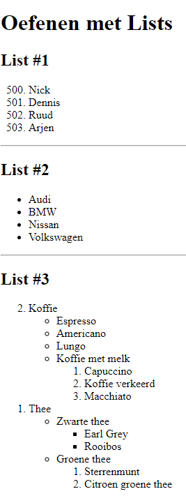
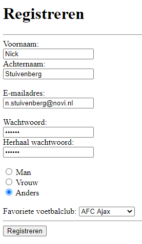

<h1>Webdevelopment - Opdrachten Les #1</h1>

<h2>Voorbereiding</h2>

Maak een nieuw project aan in Webstorm, Intellij of Visual Studio Code. Voeg daaraan de volgende webpagina's (.html) toe:

<ul>
<li>list.html</li>
<li>form.html</li>
</ul>

<h2>Opdracht 1</h2>

Maak in list.html de volgende pagina na:

<h2>Opdracht 2</h2>

Maak in form.html de volgende webpagina an:

<em>Het formulier hoeft nog niet verzonden of verwerkt te kunnen worden.</em>

<h2>Extra's</h2>

Controleer of je html code valide is: <a href="https://validator.w3.org/#validate_by_input" target="_blank">HTML Validator</a>

Gebruik <a href="https://www.w3schools.com/html" target="_blank">w3schools!</a>
